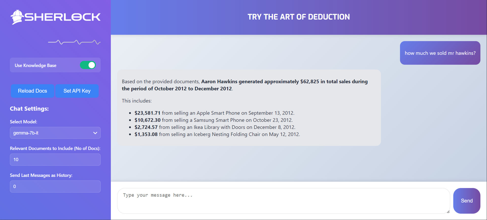
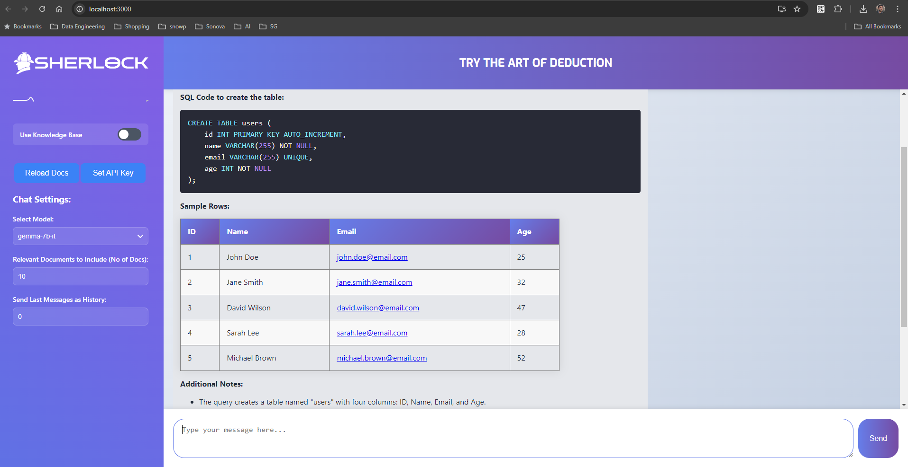

# Sherlock: AI-Powered Document Analysis Assistant

Sherlock is an AI-powered chat assistant that combines local document knowledge with general intelligence to provide accurate and context-aware responses to user queries. This project integrates various components including a Flask backend, React frontend, Ollama for AI model serving, and ChromaDB for efficient document storage and retrieval.
## Screenshots:


## Table of Contents
- [Features](#features)
- [System Architecture](#system-architecture)
- [Prerequisites](#prerequisites)
- [Installation](#installation)
- [Usage](#usage)
- [Configuration](#configuration)

## Features

- AI-powered chat interface for document analysis and general queries
- Integration with local document knowledge base
- Real-time message streaming
- Syntax highlighting for code blocks in responses
- Customizable settings for knowledge base usage and relevance
- Easy deployment using Docker Compose

## System Architecture

The system consists of four main components:

1. **Backend (Flask)**: Handles API requests, integrates with Ollama and ChromaDB, and manages document processing.
2. **Frontend (React)**: Provides the user interface for interacting with the AI assistant.
3. **Ollama**: Serves the AI language model (LLaMA 3.1).
4. **ChromaDB**: Stores and indexes document embeddings for efficient retrieval.

## Prerequisites

- Docker and Docker Compose (For installation WSL2 Docker see https://gist.github.com/martinsam16/4492957e3bbea34046f2c8b49c3e5ac0)
- NVIDIA GPU with CUDA support (for optimal performance)
- Git

## Installation

1. Clone the repository:
   ```
   git clone git@github.com:mujahidniaz/sherlock-ai-llama3.1.git
   cd sherlock-ai-llama3.1
   ```

3. Build and start the containers:
   - For Linux:
     ```
     ./run_linux.sh
     ```
   - For Windows:
     ```
     run_window.bat
     ```

## Usage

1. Access the web interface at `http://localhost:3000` in your browser.
2. Use the chat interface to interact with Sherlock.
3. Toggle the "Use Knowledge Base" option to include local document knowledge in responses.
4. Adjust the number of relevant documents and chat history messages as needed.
5. Use the "Reload Knowledge Base" button to update the system with new documents.

## Configuration

### Environment Variables

- `FLASK_ENV`: Set to `development` or `production`
- `OLLAMA_MODEL`: Specify the Ollama model to use (default: llama3.1)
- `CHROMA_HOST`: ChromaDB host (default: chromadb)
- `CHROMA_PORT`: ChromaDB port (default: 8000)

### Adding Documents

Place your documents in the `./data` directory. The system will process and index these documents for use in responses.
